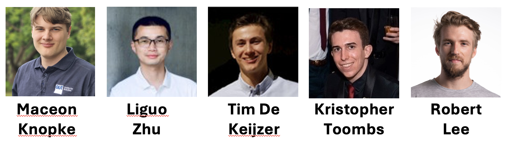

<!--  -->
<!--  -->

### Current Students
---
#### HDR Students
- Lucas Hoefs - PhD student (commenced 2025), co-supervised with [Dr. Hui Xie](https://staffportal.curtin.edu.au/staff/profile/view/hui-xie-2a396275/) and [Dr. Senjian An](https://staffportal.curtin.edu.au/staff/profile/view/senjian-an-433dd22d/), Thesis: Robust and Efficient Robotic Navigation in Complex, Dynamic Environments

#### Honours/Final-Year Project Students
- [Lachlan Raffan](https://www.linkedin.com/in/lachie-raffan2026/) - Honours student (commenced Semester 2, 2025), Project: Design of a Modular Robotic Hand with Integrated Tactile Sensing
- [Austin Suwandi](https://www.linkedin.com/in/austinsuwandi/) - Honours student (commenced Semester 2, 2025), Project: Duplication and Application of Hugging Face LeRobot SO-101 Arm with SmolVLA for Robotic Grasping and Manipulation
- Campbell Lamont - Honours student (commenced Semester 2, 2025), Project: Development and Application of eFlesh for Robotic Grasping and Manipulation of Delicate Objects
- [Md Sihab Uddin](https://www.linkedin.com/in/sihab-mte16ruet/) - Master's final-year project student (commenced Semester 2, 2025), Project: Edge AI for Real-time Hazard Prediction in Underground Mines

### Alumni
---
#### HDR Students
- [Robert Lee](https://www.linkedin.com/in/robert-lee-a8a98922b/) - QUT PhD graduate (2023), co-supervised with [Prof. Peter Corke](https://www.qut.edu.au/about/our-people/academic-profiles/peter.corke), Thesis: [Learning Robotic Manipulation of Deformable Objects in the Real World](https://eprints.qut.edu.au/242729/1/Robert+Lee+Thesis(3).pdf), now a Research Engineer at [Woven by Toyota](https://woven.toyota/en/)

#### Honours/Final-Year Project Students
- [George Calvert](https://www.linkedin.com/in/george-calvert-41ba91203/) - Curtin Honours graduate (2025), co-supervised with [Prof. Cesar Ortega-Sanchez](https://staffportal.curtin.edu.au/staff/profile/view/cesar-ortega-sanchez-8b14351c/), Thesis: Implementation of a Neural Network on a FPGA Borad
- [Kristopher Toombs](https://www.linkedin.com/in/kristopher-toombs-22374b21b/) - QUT Honours graduate (2024), Thesis: Humanoid Robotic Hand Dexterity - V1 DexHand Replication, now a Graduate Project Engineer at [Golden Cockerel](https://www.goldencockerel.com.au/)
- [Joseph Turner](https://www.linkedin.com/in/josephturner2/) - QUT Honours graduate (2024), Thesis: Assessing First Person Perspective Robotic Grasping via Wireless Instrumented Objects, now a Control System Engineer at [Witthoft Engineering](https://www.witthoft.com.au/)
- [Liguo Zhu](https://www.linkedin.com/in/liguo-zhu-2830b2271/) - QUT Master’s graduate (2023), Thesis: Comparing Tactile Sensors for Object Property Estimation and Incipient Slip Detection, now a Machine Learning Engineer at [CTM](https://www.travelctm.com/global/)
- [Maceon Knopke](https://www.linkedin.com/in/maceonknopke/) - QUT Honours graduate (2023), Thesis: Artificial Compliant Objects for Benchmarking Robotic Manipulation, now a Research Assistant at [QCR](https://research.qut.edu.au/qcr/)
- [Stephen Wardle](https://www.linkedin.com/in/stephen-j-wardle/) - QUT Honours graduate (2023), Thesis: Exploring Solutions to Achieve In-Hand Dexterous
Manipulation/Rotation for Visuo-Tactile Robotics, now a Graduate Engineer at [Aurecon](https://www.aurecongroup.com/)
- [Taylor Vogt](https://www.linkedin.com/in/taylorleevogt/) - QUT Honours graduate (2023), Thesis: Simulation Baselines for Compliant Object Manipulation and Tactile Sensing Applications, now a Professional Mechanical Engineer at [AECOM](https://aecom.com/)
- Luke Ringsgwandl - QUT Honours graduate (2022)
- Linh Vu - QUT Honours graduate (2022)

#### Research Internship Students
- [Tim De Keijzer](https://www.linkedin.com/in/tdekeijzer/) - Research Intern at QUT and Master’s student at [Eindhoven University of Technology](https://www.tue.nl/en/) (2023), now a Mechatronics Designer at [Philips](https://www.philips.com)